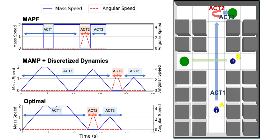
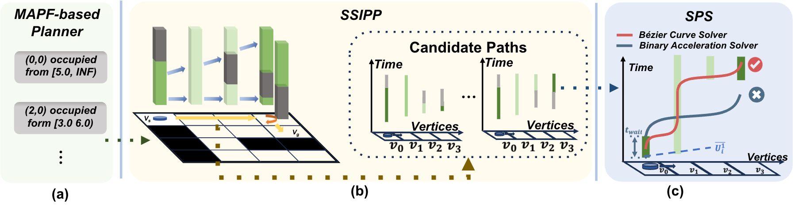
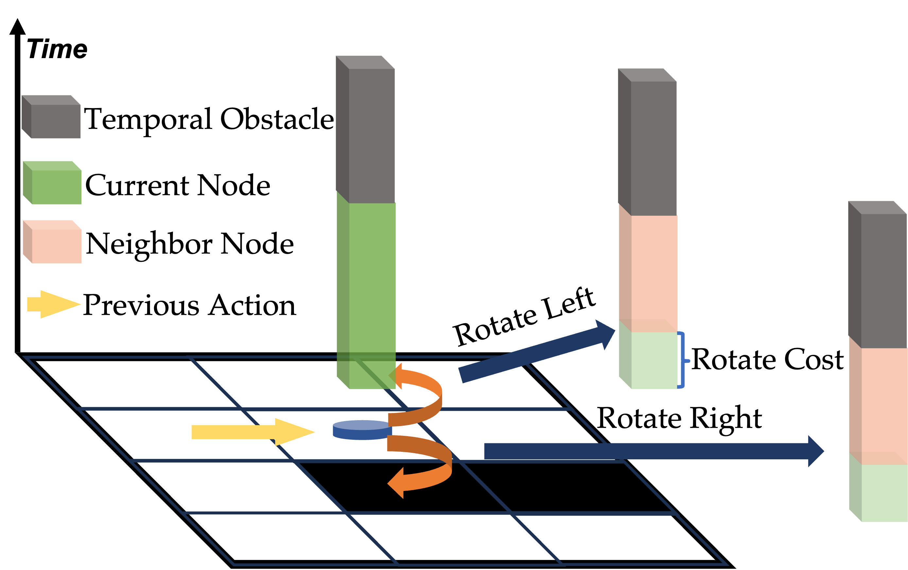
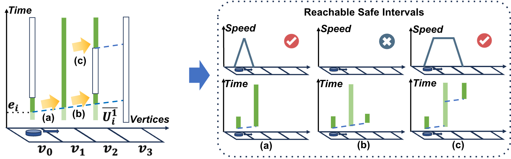
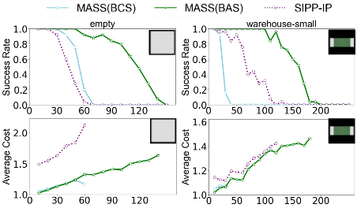

<!-- {}
Click the *Cite* button above to demo the feature to enable visitors to import publication metadata into their reference management software.
{}

{}
Create your slides in Markdown - click the *Slides* button to check out the example.
{}

Add the publication's **full text** or **supplementary notes** here. You can use rich formatting such as including [code, math, and images](https://docs.hugoblox.com/content/writing-markdown-latex/). -->
#### Motivation
How to improve the solution quality of the MAMP in realistic cases?

    
    
    <!--  -->

### MASS (MAPF-SSIPP-SPS)

    

---

### Stationary SIPP: Rotation Expansion

    

        
    

    

        <ul>
            <li>If the previous action is move, the next action must be rotation.</li>
            <li>During node expansion, generate the neighbor nodes by performing all possible rotations.</li>
        </ul>
    

---

### Stationary SIPP: Movement Expansion

    

<ul>
    <li>Find the stationary states in the current direction of the agent.</li>
    <li>Call the SPS to find a speed profile for a movement action. Generate a neighbor if one exists.</li>
</ul>

#### Results
Tested on MovingAI standard MAPF benchmark.

    
    <!--  -->
    <!--  -->

